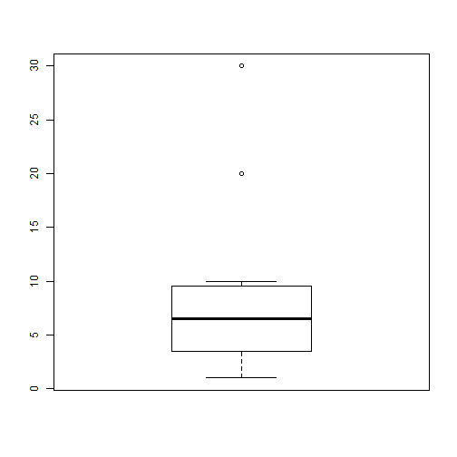

5 - Style und Conditionals
========================================================
author: Benedict Witzenberger
date: 17. April 2019
autosize: true

Wie sieht guter Stil für Programmierer aus?
========================================================

> "There are only two hard things in Computer Science: cache invalidation and naming things."

> Phil Karlton, Netscape

In R gibt es gewissen Konventionen, die helfen sollen, dass auch fremde Leute unseren Code verstehen.

Denn es gibt nichts schlimmeres als Code, den eure Nachfolger komplett umschreiben müssen, weil sie mit ihm nicht arbeiten können.

Benennung von Dateien
========================================================

Einfacher Tipp: Schreibt, was die Datei tut.

Gut:
```
load_data.R
make_graphic.R

```

Schlecht:

```
Projekt.R
test.R
final.R
```
Benennung von Variablen
========================================================

Variablen sollten immer klein geschrieben werden und mehrere Wörter durch einen Unterstrich _ getrennt werden. Nutzt niemals ein Leerzeichen, das macht nur Ärger!

Gut:
```
tag_eins
daten_alt
```

Schlecht:
```
tag1
datenAlt
`daten eingelesen`
``` 

Versucht, die Namen von bestehenden Objekten und Funktionen nicht als variablenname zu nehmen. Das geht, aber irritiert enorm.

```
True <- FALSE
c <- 10
mean <- function(x) sum(x)
```

Verschiedene Sprachen. verschiedene Akzente
========================================================

R orientiert sich bei der Benennung am ehesten an der Sprache `C`: `user_name, delete_user, create_bank_account`

Andere Sprachen, zum Beispiel Javascript nutzen CamelCase: `userName, deleteUser, createBankAccount`

Es gibt aber auch PascalCase: `UserName, DeleteUser, CreateBankAccount`

Oder die COBOL-Variante mit Bindestrich: `USER-NAME, DELETE-USER, CREATE-BANK-ACCOUNT`

Syntax: Lasst Platz
========================================================

Vor `+ - / * = > < <-` etc. sollte immer ein Leerzeichen gelassen werden. Das macht den Code viel besser lesbar.

Gut:
```
average <- mean(feet / 12 + inches, na.rm = TRUE)
```

Schlecht:

```
average<-mean(feet/12+inches,na.rm=TRUE)
```

Einrückungen
========================================================

Bei längeren Funktionsaufrufen, Dataframes oder Listen könnt ihr auch Einrückungen verwenden

```
d %>% 
mutate(
  total = a + b + c, 
  mean  = (a + b + c) / n
)
```

Normal sind bei R zwei Leerzeichen Einrückung. Außer bei langen Funktionsaufrufen.

RStudio macht das automatisch mit Strg/Cmd + I

Klammern
========================================================
Klammern sollten ans Ende einer Zeile und nicht alleine stehen.

```
if (y == 0) {
  log(x)
} else {
  y ^ x
}
```

Schlecht:
```
if (y == 0) {
  log(x)
} 
else {
  y ^ x
}
```

Kurze Statements dürfen in einer Zeile bleiben: `if (y == 0) { log(x) }`

Nutzt Kommentare
========================================================

Kommentare helfen, euren Code verständlicher zu machen. Für Andere, aber auch für euch. Aber erklärt warum ihr etwas tut, nicht, was ihr tut. Das sieht man ja im Code. 

Kommentare macht ihr mit #

Mehrzeilige Kommentare mit Strg/Cmd + Shift + C in 

Nutzt für die Optik gerne auch - oder =

```
# Load data ---------------------------

# Delete remaining Files ==============
```

Übung: Macht den Code sauber
========================================================

Findet die Fehler im Stil in den folgenden Codezeilen und korrigiert sie:

```
# setting x
x=c(1,3,6,9)

# calculating mean
mean = sum(x)/length(x)
```

Konsistente Daten
========================================================

Nachdem wir die Daten in den Dataframes korrekt bereitgestellt haben, ist die Frage: Wie überprüfen wir, dass die Daten auch sauber sind?

Fehlende Werte
========================================================

`NA`s sind immer eine Warnung: Aber was bedeutet "not available"?

In Umfragen: keine Angabe, Antwort verweigert, unbekannt?

In Rechnungen: unerlaubte Rechenoperationen, die nicht 0 ergeben dürfen

### Lösungsstrategien:

* Die meisten Funktionen in R haben ein Argument gegen NAs: `na.rm = TRUE`

* `complete.cases()` gibt nur vollständige Zeilen eines Dataframes als logischen Vektor zurück. 

* `na.omit()` schmeisst unvollständige Zeilen aus einem Dataframe

Spezialwerte
========================================================

Kommen vor allem bei mathematischen Funktionen vor. Genz selten wollen wir die wirklich haben


```r
is.finite(c(1, 2, Inf, NaN, NaN))
```

```
[1]  TRUE  TRUE FALSE FALSE FALSE
```

Ausreißer
========================================================

Ist das, was wir als Journalisten suchen. Deswegen wollen wir sie nicht entfernen, sondern finden.

Für normal-verteilte Daten helfen Box-and-Whisker-Plots, die nach der 1,5fachen IQR ab dem drittel/ersten Quartil die Outlier definieren. Das ist aber Definitionssache und kann verändert werden.


```r
x <- c(1:10, 20, 30)
boxplot.stats(x)$out
```

```
[1] 20 30
```

```r
boxplot(x)
```



Inkonsistenzen
========================================================
Ein paar Beispiele:

* Menschen können kein negatives Alter haben

* Erwachsene wiegen normalerweise mehr als 20 Kilogramm

* Autos fahren schneller als 18 km/h (vielleicht 180?)

* Ehepaare können nicht länger verheiratet sein, als sie alt sind (bzw. erwachsen sind)

Conditionals
========================================================

Ein gutes Skript muss immer wieder Entscheidungen treffen. Wir 

========================================================
========================================================
========================================================
========================================================
========================================================
========================================================
========================================================
========================================================
========================================================
========================================================
========================================================
