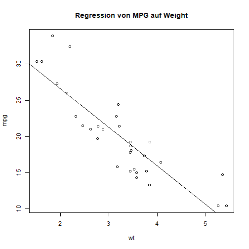
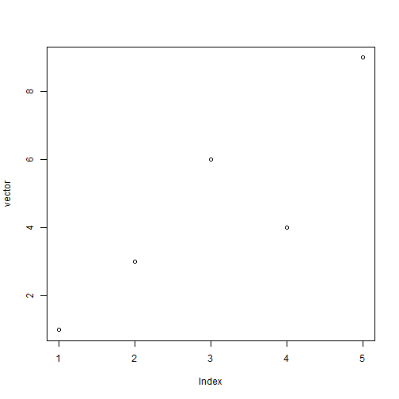
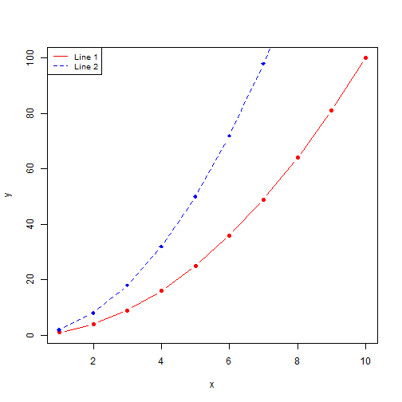
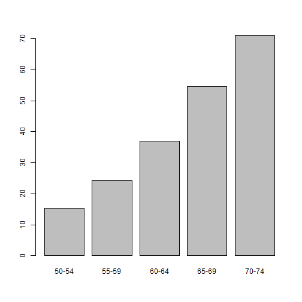
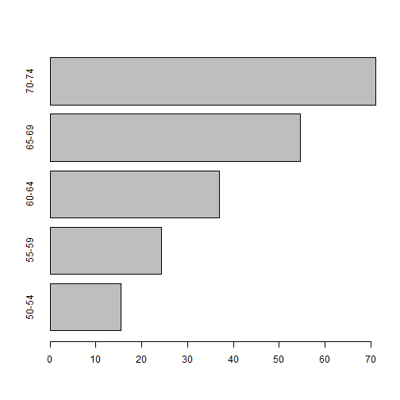
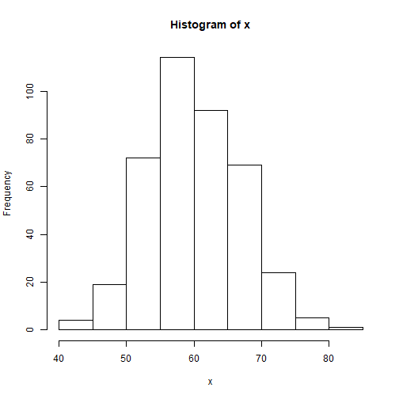
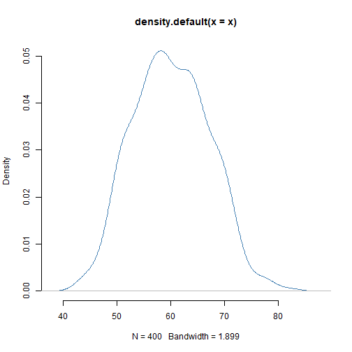

7 - Datenjournalismus, Hausaufgabe und Abschluss
========================================================
author: Benedict Witzenberger
date: 18. April 2019
autosize: true

Was wir jetzt noch vorhaben
========================================================

Kleiner Ausblick auf Datenvisualisierung mit R

Ein bisschen was zum Datenjournalistenworkflow

Wir sprechen über das Kursprojekt

Und es gibt eine kleine Hausaufgabe (juchu!)

Datenvisualisierung mit R
========================================================

Dazu gibt es einen ganzen Blockkurs (Teil IV)

Deswegen nur eine kleine Einführung:

R kann in zahlreichen Formaten Grafiken ausgeben: PNG, JPEG, PDF, SVG, ...

R kann praktisch alle Grafikformen darstellen, komplizierte Formen müssen händisch programmiert werden.

Es gibt zwei Hauptbibliotheken für Grafiken: Base und ggplot2

ggplot2
========================================================

Entwickelt seit 2005 von Hadley Wickham

basiert auf Leland Wilkinsons "Grammar of Graphics" - das heißt: Grafiken werden in Einzelteile zerlegt und dargestellt. 

das heißt für uns: Wir können die Grafiken sehr einfach umkonfigurieren

eines der beliebtesten R-Packages

aktuelle Version 3.1.1

Der Einstieg ist relativ einfach, aber die Möglichkeiten muss man sich aufwendiger erschließen

Base
========================================================

Standard-Grafikbibliothek in R, vorinstalliert.

Geht sehr einfach und schnell

Reicht für kleine Analysen


```r
attach(mtcars)
plot(wt, mpg)
abline(lm(mpg~wt))
title("Regression von MPG auf Weight")
```



Scatterplot
========================================================

```r
vector <- c(1, 3, 6, 4, 9)

plot(vector)
```



***

Weitere Einstellungsmöglichkeiten in `plot()`:

`main =` Titel

`xlab/ylab = ` X-Achsenbeschriftung

`pch = ` Form der Punkte:


`col = ` Farbe

`font = ` Schriftart

`cex = ` Schriftgrößen (in diversen Abstufungen, wie cex.main, cex.sub, cex.lab) 

`frame = ` TRUE/FALSE für Rahmen


Liniendiagramm
========================================================


```r
x<-1:10; y1=x*x; y2=2*y1

plot(x, y1, type="b", pch=19, col="red", xlab="x", ylab="y")

lines(x, y2, pch=18, col="blue", type="b", lty=2)

legend("topleft", legend=c("Line 1", "Line 2"),
       col=c("red", "blue"), lty=1:2, cex=0.8)
```



Wichtig: `lines()` alleine zeichnet keinen Graph, vorher muss `plot()` aufgerufen werden.

***

`type = ` welcher Plot-Typ gezeichnet werden soll ("p" für "points", "l" für "lines", "b" für "both")

`lty = ` Linientyp

`legend()` fügt eine Legende hinzu

Säulendiagramm
========================================================

Nutzen wir das Dataset VADeaths (Todesrate pro 1000 in Virginia in 1940, Altersgruppen ab 50 Jahren):


```r
x <- VADeaths[1:5, "Urban Male"]

barplot(x)
```



```r
barplot(x, horiz = TRUE)
```



***

`names.arg =` Namen der Gruppen ändern

`border =` Farbe der Ränder (einzeln, oder als Vektor)

`beside =` TRUE/FALSE für gruppierte Säulen/Balken

`legend = rownames(VADeaths)` würde das Diagramm stapeln.

Histogramm
========================================================


```r
x <- c(rnorm(200, mean=55, sd=5), rnorm(200, mean=65, sd=5))

hist(x)
```




### Abwandlung: Desityplot

```r
dens <- density(x)
plot(dens, frame = FALSE, col = "steelblue")
```



***

`breaks =` legt die Zahl der Bruchpunkte fest (oder den Algorithmus, der sie berechnet - z.B. Strurges (default) Scott oder Freedman-Diaconis)

`polygon(dens, col = "steelblue")` würde den Density-Plot mit Farbe füllen

Graph als Bild speichern
========================================================

In RStudio:


***

Im R-Code:

* Vor dem `plot()`: `jpeg()`, `png()`, `svg()` oder `pdf()` mit entsprechendem Dateinamen und (falls gewünscht) Größenangaben (`width`, `height`)

* `plot()` erstellen

* `dev.off()`

```
jpeg("grafik.jpg", width = 1024, height = 768, units = "px")
plot(x, y, main = "Das ist der Titel")
dev.off()
```

Datenjournalismus: Zwei Herangehensweisen
========================================================

### Von den Daten her

Wir haben Daten und suchen darin nach einer Geschichte:

* Minimum/Maximum

* Ausreißer

* NAs, wo keine sein sollten; Daten, wo keine sein sollten

* Durchschnitt

* Häufungen

* Wandel, Trends

* Muster aufzeigen

***

### Von der These her

Lassen sich Daten finden, die These bestätigen können?

* These operationalisieren

* Datenbanken durchsuchen

* Forscher kontaktieren

* eigene Variablen messen

* eigene Berechnungen durchführen

* <-- auch die Fragen von links helfen

Ist Datenjournalismus wirklich nötig?
========================================================


Quelle: [New York Times 2020 Report](https://www.nytimes.com/projects/2020-report/index.html)

Was ist Datenjournalismus?
========================================================

>"important, focused information that is useful to people’s lives and helps them understand the world" *Adrian Holovaty 2006*

Daten + Frage + Analytisches Vorgehen = Datenjournalismus

Wer macht Datenjournalismus?
========================================================

* Sozialwissenschaftler

* Entwickler

* Kartographen

* Statistiker

* Mathematiker

* bislang wenige "studierte" Datenjournalisten (aber es gibt inzwischen einige Studiengänge: Dortmund, Leipzig)

Welche Skills braucht es?
========================================================

* Data Literacy

* Programmieren/Coden (oder: Tools kennen?)

* Designen

* Schreiben

* Recherchieren

* Transparenz


Wie funktioniert Datenjournalismus
========================================================

Daten recherchieren 

-> Daten bereinigen 

-> Daten analysieren [Aufgabe der Datenjournalisten, nur manchmal mit Entwicklern]

-> Daten visualisieren [Designer und Entwickler]


Datenjournalismus bei der SZ
========================================================

"Daten-Team" der Entwicklungsredaktion (neben Video, Podcast, Storytelling):

* 3 DatenjournalistInnen von SZ.de

* ein SZ.de-Datenvolontär

* 2 Datenjournalisten von der Zeitung

* 1-2 Entwickler

* 1 Designer

**Technik**: R, Phyton, QGis, Spark, Javascript, SQL, HTML, CSS, Google Docs, Adobe Illustrator

**Projektdauer**: kurz-, mittel- und langfristige Projekte. 
Tendenz: mittel- und langfristig

**Ziel**: Visuellen Journalismus bei der SZ fördern, ansprechbar sein für "programmierte Recherche", Knowhow im Bereich AI/KI und Datenschutz

Zwei Beispiele für SZ-Datenstücke
========================================================

[Ein Jahr Trump](http://sz.de/1.3826251) 

[Liga der Langeweile](http://sz.de/1.3836500)

Wo kommen die Daten her?
========================================================

Früher vor allem bestehende Datenbanken:

* DeStatis

* data.un.org

* www.who.int/gho/database/en/

Heute eher:

* Twitter
* OpenStreetMap

Theoretisch: Alles, was scrapebar ist

Was ändert sich?
========================================================

* Open Source und Open Data wird immer mehr (in Deutschland nur sehr zurückhaltend)

* Informationsfreiheitsgesetze in Deutschland (und den meisten Ländern, immer noch drei Bundesländer ohne entsprechende Gesetze: Bayern, Niedersachsen, Sachsen)

* sehr gut vernetzte Datenjournalistenszene

* Programmieren lernen wird immer einfacher (Codecademy etc.)

* viele kostenlose oder billige Tools (Datawrapper, CartoDB, QGIS)

Kritik: Stagnation im Datenjournalismus
========================================================

> "Allerdings meine ich, eine Stagnation zu beobachten: Lebte das Genre in den ersten Jahren vom Reiz des Neuen, das Dank aufsehenserregender Visualisierungen hervorstach, sind die Formate nun weitgehend ausgereizt. [...] Doch der Drang zum Leuchtturm-Projekt (oder Liebhaber-Projekt einzelner Redakteure) herrscht weiter vor. Ich persönlich finde das mittlerweile recht ermüdend, weil eben keine Weiterentwicklung zu erkennen ist: Weder thematisch noch konzeptionell. Im Gegenteil: Die Themensetzung wirkt oft wahllos oder gar willkürlich."
> 
> *Lorenz Matzat Ende 2018 auf seinem [Blog](https://www.datenjournalist.de/10-jahre-datenjournalismus-gemischte-gefuehle/)*

***
Antwort der SZ-Daten-Teamleiterin:


[Quelle zum Tweet](https://twitter.com/Remrow/status/1075692284195295233)

Mehr dazu: [Gespräch in "Was mit Medien" (Dlf Nova)](https://www.deutschlandfunknova.de/beitrag/datenjournalismus-wenn-big-data-fuer-schlagzeilen-sorgt)

Wie geht's jetzt weiter?
========================================================

**Vorschlag**: Wir entwickeln alleine oder in Kleingruppen datenjournalistische Projekte, die am Ende des R-Bootcamps fertig sein sollen.

### Fragen:

Was passt zu euch / zu eurer Redaktion?

Habt ihr Ideen oder Thesen?

Wo könntet ihr anfangen zu suchen?

### Next Steps: 

Daten organisieren/recherchieren

Wir sprechen uns am _20. Mai um 20.15 Uhr_ per Videocall, bis dahin sollte die These stehen.

Bei Fragen könnt ihr jederzeit in Slack (ddj19) schreiben, oder mir eine Mail schicken: b.witzenberger@gmail.com

Hausaufgabe
========================================================

Im Github habe ich eine Aufgabe vorbereitet, die euer Wissen aus diesem Seminar testen soll.

Abschluss Block 1
========================================================

Abschlussrunde:

* Was ist bei euch besonders hängen geblieben?

* Was hättet ihr gerne mehr gemacht? / was weniger?

* Habt ihr das Gefühl, ihr habt alles verstanden?
